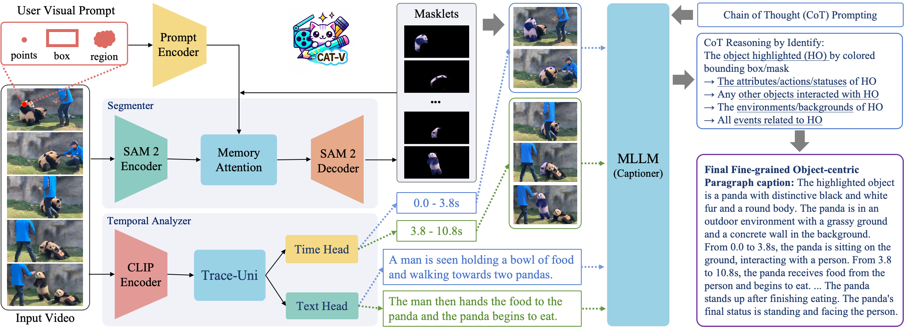

# CAT-V
Official PyTorch implementation of [Caption Anything in Video: Fine-grained Object-centric Captioning via Spatiotemporal Multimodal Prompting](https://arxiv.org/abs/2504.05541)



## 🚀 Updates

## 🕹️ Demo

## 🛠️ Getting Started

1. Set up a conda environment (python>= 3.10) using:

```bash
conda create -n cat2 python=3.10 -y
conda activate cat2
```

2. Install the requirements:

```bash
pip install -e .
```

3. Download checkpoints:

```bash
cd checkpoints && \
./download_ckpts.sh && \
cd ..
```

## 🏃 RUN

```
bash inference.sh
```


## 📖 Citation
If you find this work useful for your research or applications, please cite using this BibTeX:

```bibtex
@inproceedings{tang2025cat-v,
  title={Caption Anything in Video: Fine-grained Object-centric Captioning via Spatiotemporal Multimodal Prompting},
  author={Tang, Yunlong and Bi, Jing and Hua, Hang and Xiao, Yunzhong and Song, Yizhi and Liu, Pinxin and Huang, Chao and Feng, Mingqian and Guo, Junjia and Liu, Zhuo and Song, Luchuan and Liang, Susan and Shimada, Daiki and Vosoughi, Ali and He, Jinxi and He, Liu and Zhang, Zeliang and Luo, Jiebo and Xu, Chenliang},
  journel={arXiv},
  year={2025}
}
```


## 🙏 Acknowledgements
This work was supported by Sony Group Corporation. We would like to thank Sayaka Nakamura and Jerry Jun Yokono for their insightful discussion.

We are also grateful for the following awesome projects our CAT-V arising from:

- [Caption Anything](https://github.com/ttengwang/Caption-Anything)
- [SAM 2](https://github.com/facebookresearch/sam2)
- [SAMURAI](https://github.com/yangchris11/samurai)
- [TRACE-uni](https://github.com/gyxxyg/TRACE)
- [VideoLLaMA2](https://github.com/DAMO-NLP-SG/VideoLLaMA2)
- [Qwen2.5-VL](https://github.com/QwenLM/Qwen2.5-VL)
- [InternVL-2.5](https://internvl.github.io/blog/2024-12-05-InternVL-2.5/)


## 👩‍💻 Contributors
Our project wouldn't be possible without the contributions of these amazing people! Thank you all for making this project better.

- [Yunlong Tang](https://yunlong10.github.io/) @ University of Rochester
- [Jing Bi](https://scholar.google.com/citations?user=ZyCYhUkAAAAJ) @ University of Rochester
- [Chao Huang](https://wikichao.github.io/) @ University of Rochester
- [Susan Liang](https://liangsusan-git.github.io/) @ University of Rochester
- [Daiki Shimada](https://scholar.google.co.jp/citations?user=1uAwouQAAAAJ) @ Sony Group Corporation
- [Hang Hua](https://hanghuacs.notion.site/Hang-Hua-151c5b68f62980e8884febf1b5c1d4a9) @ University of Rochester
- [Yunzhong Xiao](https://shawn-yzxiao.github.io/) @ Carnegie Mellon University
- [Yizhi Song](https://song630.github.io/yizhisong.github.io/) @ Purdue University
- [Pinxin Liu](https://andypinxinliu.github.io/) @ University of Rochester
- [Mingqian Feng](https://fmmarkmq.github.io/) @ University of Rochester
- [Junjia Guo](https://doujiangter.github.io/JunjiaGuo.github.io/) @ University of Rochester
- [Zhuo Liu](https://joeliuz6.github.io/) @ University of Rochester
- [Luchuan Song](https://songluchuan.github.io/) @ University of Rochester
- [Ali Vosoughi](https://alivosoughi.com/) @ University of Rochester
- [Jinxi He](https://gingin520.github.io/) @ University of Rochester
- [Liu He](https://arking1995.github.io/) @ Purdue University
- [Zeliang Zhang](https://zhangaipi.github.io/) @ University of Rochester
- [Jiebo Luo](https://www.cs.rochester.edu/u/jluo/) @ University of Rochester
- [Chenliang Xu](https://www.cs.rochester.edu/~cxu22/index.html) @ University of Rochester


<a href="https://github.com/yunlong10/CAT-V/graphs/contributors">
  
</a>

### 🌟 Star History

[](https://star-history.com/#yunlong10/CAT-V&Date)
